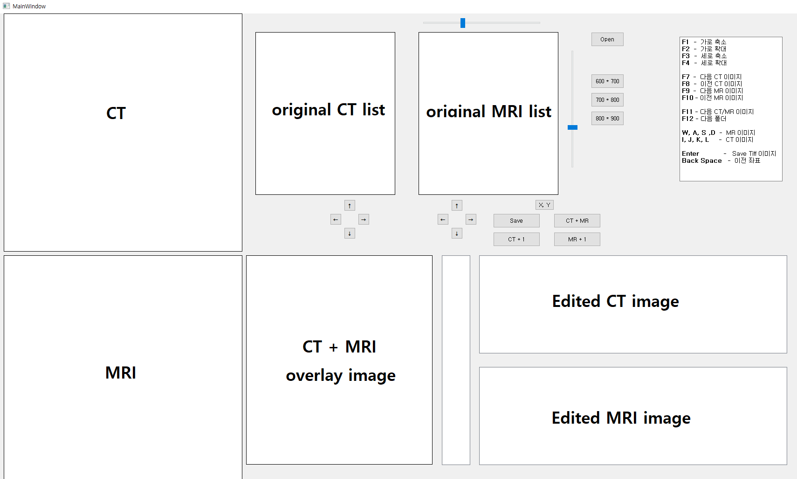

# Pixel_processing

------------------------------

**프로젝트** : 이미지 편집 프로그램 
 

**프로젝트 설명** : 신체의 동일 부위를 촬영한 CT/MRI 이미지를 딥러닝에 활용할 수 있도록 동일한 해상도, ROI(Region Of Interest)로 재가공하는 프로그램

**배경** : CT image <-> MRI image로 변환하는 프로젝트를 진행하기 위해서 동일한 해상도와 ROI를 가진 CT/MRI 이미지가 필요함.
 
 
하지만 현실적으로 촬영 장비, 촬영할 수 있는 구간의 길이 등 여러 가지 제약사항이 있기 때문에 수작업으로라도 편집할 수 있는 프로그램이 필요함. 

그래서 작업 시간을 줄이기 위해 이를 도울 수 있는 프로그램을 제작함.

bit depth가 16bit인 dicom image를 ROI 편집 후 TIFF image로 저장.

